# Initial Setup
This first part of the tutorial goes over the setup required to start modding Shogun Showdown with the help of Content Loader - by the end of it, you'll learn how to create a base mod, which loads into the game and connects with Content Loader. Next parts of the tutorial will go over using that connection to add new things into the game.

## Preparations
There are a few things you need to get ready before you can begin:
1. A copy of Shogun Showdown, setup with Unity Mod Manager, and with Content Loader installed. If you somehow don't have that yet, follow this tutorial by TheRotBot: https://youtu.be/Zuh_wjUYw-c
2. Any code-editing software that can build libraries (.dll files) from code written in C# - I will be using Visual Studio 2022 in this tutorial
3. Unity version 2021.3.43 - you can download it from https://unity.com/releases/editor/archive
4. dnSpy, or other software that allows for viewing a Unity game's code (not needed in this tutorial, crucial for actual modding)
	- Alternatively, a tool to decompile the game entirely can be used, so that you can access the game's code as script files, but it takes more setup and provides no real benefit for simple mods, so I won't go over setting that up here.
5. A collection of reference libraries (I'd recommend copying them into a single folder), which contains:
	- All Shogun Showdown libraries, found by going into the game's directory, then ShogunShowdown_Data\Managed
	- UnityModManager.dll and 0Harmony.dll, which can both be found in the same Managed directory, inside the UnityModManager folder.
	- ShogunShowdownContentLoader.dll, from my Shogun Showdown Content Loader mod

## Workspace Setup
1. Go into your Shogun Showdown mods folder (It will be in the game's directory, the same one you set in Unity Mod Manager)  
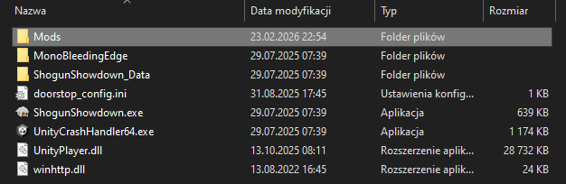
2. Create a new folder there, give it any name you want. This will be your mod's folder.  
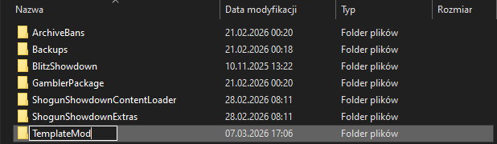
3. Create a new Unity project, using the default 2D template.  
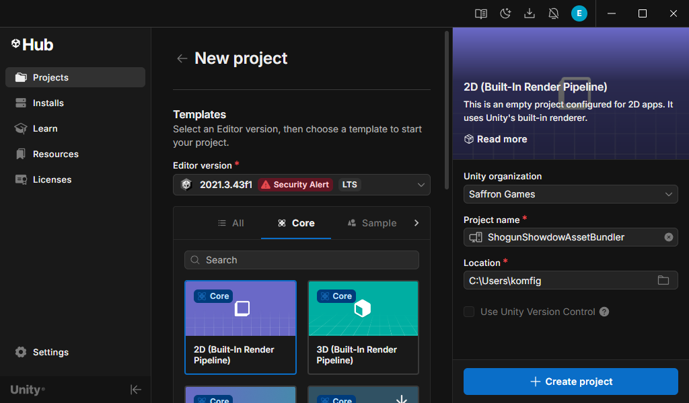
4. In the project, create a new C# script "BuildBundles", with the following code:
    ```csharp
    using UnityEditor;

    #if UNITY_EDITOR
    public class BuildBundles
    {
        [MenuItem("Assets/Build AssetBundles")]
        static void BuildAll()
        {
            BuildPipeline.BuildAssetBundles("Assets/AssetBundles", BuildAssetBundleOptions.None, BuildTarget.StandaloneWindows);
        }
    }
    #endif
    ```
5. If you're going to follow the next parts of this tutorial immediately, keep this Unity project open, otherwise you can close it for now.
6. Create a new C# Library project in your code editor of choice.
	- In Visual Studio it's "Class Library (.NET Framework)".  
	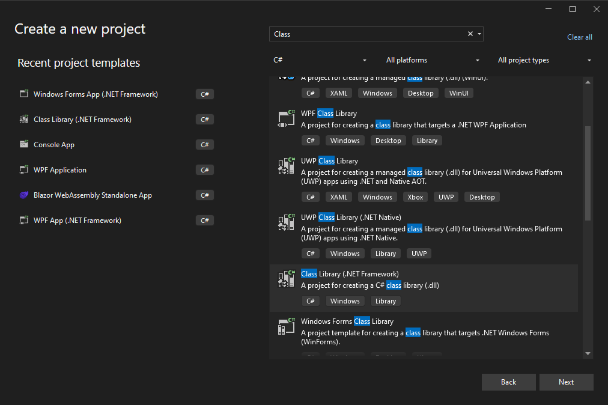
	- Set your project's name, leave the other settings unchanged.
6. Add necessary References: ShogunShowdownContentLoader.dll, 0Harmony.dll, UnityModManager.dll, Assembly-CSharp.dll, UnityEngine.dll, UnityEngine.CoreModule.dll and UnityEngine.AssetBundleModule.dll
	- In Visual Studio: Project -> Add Reference -> Browse... and select these .dll files.
	- Then, in the Browse tab of the Reference Manager window, toggle each of them on, and close the window with "OK"  
	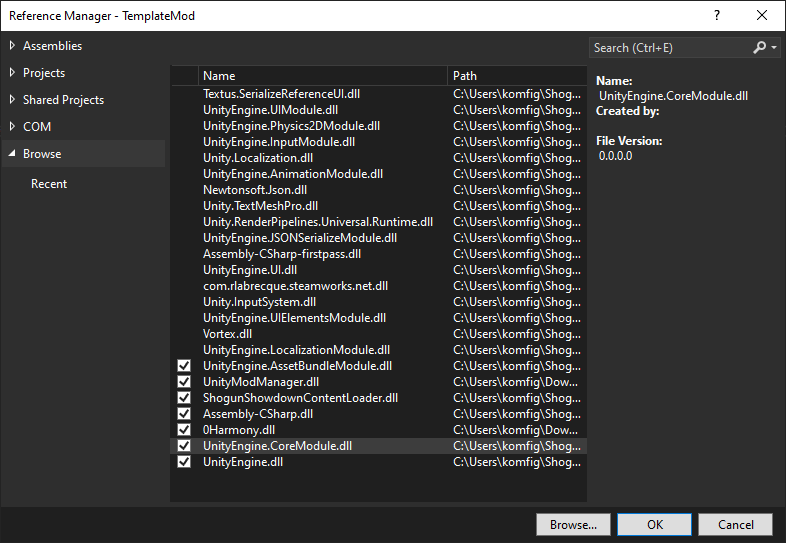
	- Finally, in Solution Explorer, open "References" and select the seven libraries added, change their "Copy Local" to false.  
	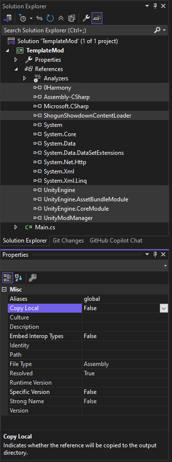
7. For convenience, it's a good idea to switch the build location to your mod's folder. This way, you can test changes in game immediately after building.
	- In Visual Studio: Project -> (ProjectName) Properties -> Build -> Output path  
	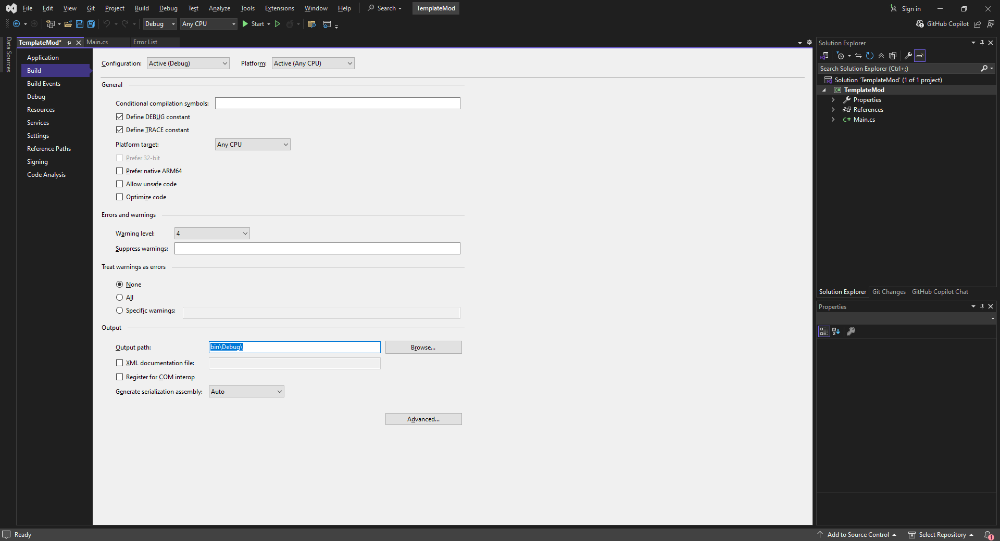

## Backend Connections
1. Create the core script (or rename the one created by default). Call it something like "Master" or "Main"
	- If you're renaming an existing script, make sure that both the class name within the file, and the file itself are renamed.  
	  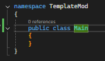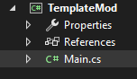
2. At the start of the script add
    ```csharp
    using HarmonyLib;
    using UnityModManagerNet;
    using UnityEngine;
    ```
3. Then inside the class:
    ```csharp
    static AssetBundle bundle = null;
    static bool Load(UnityModManager.ModEntry modEntry)
    {
        var bundlePath = System.IO.Path.Combine(modEntry.Path, "templatemod");
        bundle = AssetBundle.LoadFromFile(bundlePath);

        Dictionary<string, object> contentData = new Dictionary<string, object>();

        if (!ContentLoader.Main.LoadContent("TemplateMod", contentData, bundle)) return false;

        var harmony = new Harmony("com.erukolindo.templatemod");
        harmony.PatchAll();

        return true;
    }
    ```
   Where:
   - "templatemod" in `var bundlePath = System.IO.Path.Combine(modEntry.Path, "templatemod");` needs to be replaced with a name of your asset bundle. It cannot contain capital letters, spaces or special characters. We'll be using the name you pick here in later parts of the tutorial.
   - "TemplateMod" in `if (!ContentLoader.Main.LoadContent("TemplateMod", contentData, bundle)) return false;` is the internal identifier used by the Content loader. It can be any string, I recommend your mod's name written in PascalCase.
   - "com.erukolindo.templatemod" in `var harmony = new Harmony("com.erukolindo.templatemod");` is the identifier used by the mod manager itself. The naming convention is typically "com.\<creator>.\<modName>"
4. Build the project.
	- In Visual Studio it's Build -> Build Solution, or F6.
5. Check the mod's folder. Do you have a single .dll file there?
	- If you don't have it, check if you correctly set your project's build destination
	- If you have multiple .dll files, you probably didn't set "Copy Local" (or the equivalent in your code editor) to false on one or more of the reference libraries
	- Any temporary files that appear (such as .pdb or CACHE files) can be safely ignored, though you should delete them before compressing the mod to upload it.
6. Still in the mod's folder, create an empty text file "Info.json" (make sure it's not something like "Info.json.txt"), or copy one from a different mod.
7. Open that file in any text editor and fill it out like this:
    ```json
    {
        "Id": "TemplateMod",
        "DisplayName": "Template Mod",
        "Author": "Erukolindo",
        "Version": "0.1.0",
        "LoadAfter": [ "ShogunShowdownContentLoader" ],
        "AssemblyName": "TemplateMod.dll",
        "EntryMethod": "TemplateMod.Main.Load"
    }
    ```
Where:
- Id - the unique identifier of your mod. It can be anything you want, as long as it's different from any other mod you want to be compatible with yours.
- DisplayName, Author, Version - these are purely for the mod manager's UI, they can be whatever you want.
- LoadAfter - keep this one exactly as in the example, this ensures Content Loader is ready to receive this mod's data.
- AssemblyName - the name of the mod's .dll file.
- EntryMethod - the path to the Load function in your code. The format is "\<namespace>.\<class>.\<function>"  
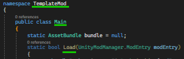
8. Save the file, and launch Shogun Showdown. If you've done everything right, you should see something like this:  
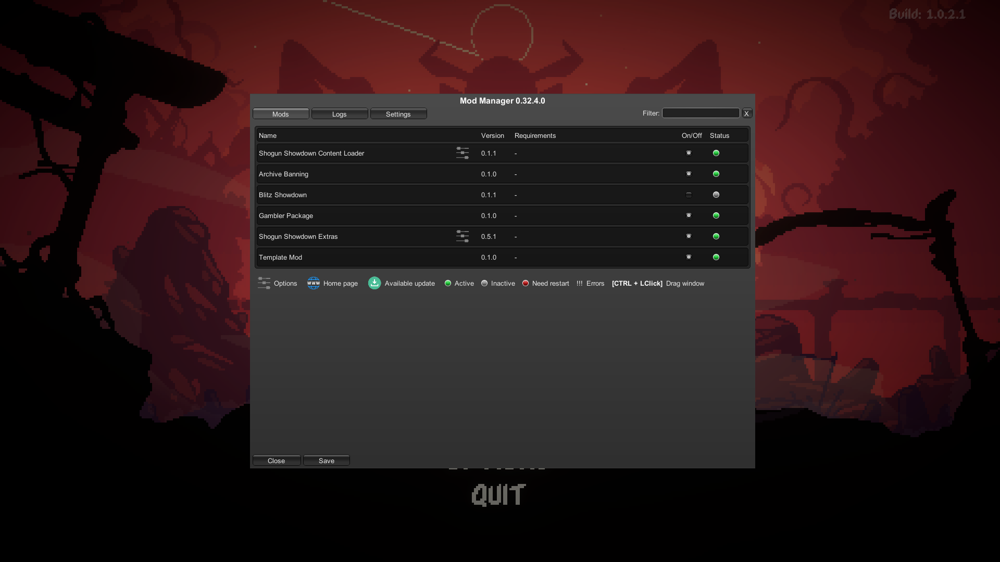
    All loaded mods, including the one you created, showing their status as "Active", with no errors.

At this point your mod is fully integrated and ready for you to start the modding proper, the details of which will be covered in the following parts of the tutorial.
