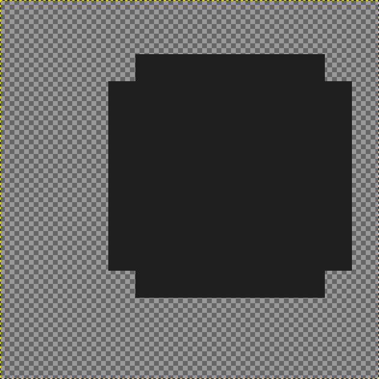

# New Quests
This part of the tutorial goes over implementing custom quests into the game, and setting up unlocks that happen on quest completion.

## Preparations
Similar to tiles and skills, you need to prepare a quest ID and icon sprites. For IDs take a look at the ID spreadsheet: https://docs.google.com/spreadsheets/d/1tdUzB7I_MYt-21PAUd7llhtjSbyPcuJnGNYMEfMQeVg/edit?usp=sharing
There, in the Quests/Unlocks worksheet, select a **NEGATIVE** ID value that's not used by any unlock listed there. Positive values sometimes just don't work, and I haven't investigated why, since negative ones are perfectly fine. I began quest IDs at -3000, but that's not a requirement. Note it down for future reference as your Quest ID.

For sprites, you should follow these guidelines:
1. Start with a 14x14 canvas, draw a background in the form of a 9x9 pixels square, filled with dark gray (exact hex code being #1f1f1f), except for the four pixels in the corners. It needs to be placed 2 pixels from the top and 1 pixel from the right (yes, it's weird, but that's what the base game is set up to expect)  
   
2. Draw the sprite's image within the central 7x7 square using only a #f8c53a yellow.
3. Save that image as a .png file with a name of "QuestSymbols\_\<TechnicalName>\_yes" (where technical name is typically the tile's name in PascalCase).
4. Make a copy of the image, replacing the background color with #c09473 and main color with #ad7757, saving it as a .png named "QuestSymbols\_\<TechnicalName>\_no"

Then, configure the sprites in Unity. For the most part it's the same as tiles, though without changing the pivot. Select all your sprites and set the following in the inspector:
1. Texture Type: Sprite (2D and UI)
2. Sprite Mode: Single
3. Pixels per Unit: 32
4. Filter: Point (no filter)
5. Format: RGBA 32 bit  


Then, add the icons to the asset bundle: keep all the sprites selected. At the bottom of the inspector, you should see the AssetBundle dropdown (if you don't, click the double line to expand the collapsible section there). Open the dropdown, and select your asset bundle name, or add it if you're setting up assets for the first time. Use the asset bundle name you wrote at the beginning of the Load function in the Initial Setup tutorial.  
  


Once that is all set up, click Assets -> Build Asset Bundles. When that process finishes, copy your asset bundle and its .manifest file from AssetBundles to your mod's folder.  


## Vanilla Quests
Some quest types in the base game are used for multiple different quests, through having parameters that can be edited. It's unlikely, but not impossible that you'll want to add a quest using one of those, so let's cover them first:
- AllTilesCooldownValueQuest - used by Blitz and Juggernaut, this quest is complete if you win a run with all your tiles having one of the specified cooldown values.
- ColossalAttackQuest - unsurprisingly used by Colossal Attack. Triggers if you deal enough damage with a single attack. You can specify how much damage is required.
- HeroStampQuest - triggers upon obtaining a specific stamp with any hero. Already used by Speedrunner, Strategist, Combomancer, and Obliterator quests, so you probably won't get much use out of that one.
- IslandClearedQuest - used by every defeat boss quest. Allows you to specify the region to beat and the minimum day on which to beat it.
- PuppetMasterQuest - used by Pupper Master. Triggers after enough enemies get killed with friendly fire, and you can specify the exact number.
- ComboQuest - used by Triple Threat, Fourfold Finesse and Supreme Combo. Triggers if you get enough kills in a single turn, and you can specify the number required
- StingyQuest - used by Thrifty. Triggers if you have enough coins at any point during the run. You can specify the amount of coins.

For this example, I'll use AllTilesCooldownValueQuest to create an "All or Nothing" quest, which requires you to have all your tiles at either 0 or 8 cooldown. Additionally, I'll show how to attach unlocks to quests.

Because this quest is based on a vanilla class, the only setup needed takes place in the core script (Main, Master or whatever you named it). Specifically, most of the quest's data will live in a constructor function:
```csharp
private static Quest AllOrNothingQuest()
{
	//general setup
    AllTilesCooldownValueQuest quest = ScriptableObject.CreateInstance<AllTilesCooldownValueQuest>();
    AccessTools.Field(typeof(Quest), "LocalizationTableKey").SetValue(quest, "AllOrNothing");
    quest.unlockID = (UnlockID)(-3005);
    quest.additionalUnlocks = new UnlockID[1] { (UnlockID)(-2034) };
    quest.requiredUnlocksForUnveiled = new UnlockID[0];
    quest.symbolNotCompleted = bundle.LoadAsset<Sprite>("QuestSymbols_AllOrNothing_no");
    quest.symbolCompleted = bundle.LoadAsset<Sprite>("QuestSymbols_AllOrNothing_yes");
	
	//class specific setup
    AccessTools.Field(typeof(AllTilesCooldownValueQuest), "cooldownValues").SetValue(quest, new int[2] { 0,8 });
    
    return quest;
}
```
(you might need to add `using UnlocksID;` at the top of that class if you don't already have it)
The general section has the same lines for all quests, filled out with appropriate data for the specific quest:
1. In `AllTilesCooldownValueQuest quest = ScriptableObject.CreateInstance<AllTilesCooldownValueQuest>();` you put in the class of your quest in two places.
2. In `AccessTools.Field(typeof(Quest), "LocalizationTableKey").SetValue(quest, "AllOrNothing");` you put your quest's technical name inside the second set of quotation marks.
3. In `quest.unlockID = (UnlockID)(-3005);` just put in the quest ID you selected before.
4. In `quest.additionalUnlocks = new UnlockID[1] { (UnlockID)(-2034) };` you can set up as many unlock IDs as you want, which will become unlocked when the quest is completed. For this example it's the unlock ID of the Whetstone skill from the previous tutorial. If you don't want any, write `new UnlockID[0]`, and if you want more than one, the format is `new UnlockID[3] { (UnlockID)(-2033), (UnlockID)(-2034), (UnlockID)(-2035) }`.
5. In `quest.requiredUnlocksForUnveiled = new UnlockID[0];` you can set up any number of unlock IDs, the same way as for additionalUnlocks. These are things that have to be unlocked for this quest to show its name and description in the archive.
6. In `quest.symbolNotCompleted` and `quest.symbolCompleted` put in the names of the quest icons you created in the setup step - typically `QuestSymbols_[technical name]_[yes/no]`.

Additionally, to make a tile or a skill properly unlockable via a quest, you should set it up so it's not unlockable in the camp. Which is as simple as setting its unlock handling to "Ignore":
```csharp
private static List<SkillData> skillsToLoad = new List<SkillData>
{
    new SkillData("Whetstone", 1002, -2034, typeof(WhetstoneSkill), SOHandlingEnum.Ignore, SOHandlingEnum.Generate, 20),
};
```
For skills, it's the first SOHandlingEnum, for tiles it's the only one.

The class-specific section in this case consists of simply assigning the required cooldown values as 0 and 8. I won't get into details of AccessTools here, but here's how you make them work for this specific use case:
1. Using DnSpy or a similar tool, access Shogun Showdown's scripts and find the script for the quest you're making a variant of (it'll be using the no-spaces name I gave at the top of the section)
2. Find the type name of the value you're looking to modify. It should look something like this:
```csharp
[SerializeField]
private int[] cooldownValues;
```
   (In this case the type is `int[]` and the name is "cooldownValues")
3. In your quest's constructor function, for each value you need to modify, add a line based on this template:
```csharp
AccessTools.Field(typeof(QuestScriptName), "variableName").SetValue(quest, variableValue);
```
   replace "QuestScriptName" and "variableName" with what you found in previous steps, and "variableValue" with your desired value. If it's text, it needs to be in parenthesis, a number is written directly, and arrays (ones defined with `[]`) need a specific format, where you specify the number of values in the array, then list them one by one i.e.: `new int[2] { 0,8 }`

Make sure the function ends with `return quest;`

Then, still in the core script, if you don't have it already, add:
```csharp
private static List<Func<Quest>> questsToLoad = new List<Func<Quest>>
{
};
```
And for every quest simply add the name of its constructor function inside, separated with commas.

If you don't yet have a
```csharp
private static Dictionary<(string table, string key), string> stringsToLoad = new Dictionary<(string, string), string>()
{
};
```
then add it. Inside, for every tile you're adding, insert 2 lines: `{ ("Metaprogression", "LocalizationKey_Name"), "Your quest's name as seen in game" },` and `{ ("Metaprogression", "LocalizationKey_Description"), "Your skill's description as seen in game" },`, replacing LocalizationKey with the one you set in the quest constructor function for both of them, and putting in the name and description you want to see in game.

If you want to add the text in other languages too, create a copy of the above dictionary, appending the name with underscore + the code of the language. For example: `stringsToLoad_pl` (codes of languages implemented in Shogun Showdown: English (en), French (fr), German (de), Spanish (es), Japanese (ja), Korean (ko), Polish (pl), Portuguese (pt), Russian (ru), Simplified Chinese (zh-hans), Traditional Chinese (zh-hant)). Then replace the values in that dictionary (the text that's meant to be visible in-game) with your translations.

Inside the load function, immediately after `Dictionary<string, object> contentData = new Dictionary<string, object>();`, add the lines you don't have out of
```csharp
contentData["stringsToLoad"] = stringsToLoad;
contentData["questsToLoad"] = questsToLoad;
```

If you implemented any additional language tables, add them to content data in the same way - e.g.:
```csharp
contentData["stringsToLoad_pl"] = stringsToLoad_pl;
```

If you've done everything right, you should be able to build the mod, then open the game and see a quest in the archive, and be able to complete it.

## Custom Quest
Most of the setup for a custom quest will be identical to a vanilla one, the main difference being that you need to create a new quest class. As an example I'll make an "Outsmarted" quest, which requires you to kill Hideyoshi with enemy damage, and only unlocks once you beat Hideyoshi's Keep for the first time.

1. Using DnSpy or a similar tool, access Shogun Showdown's scripts and find a script for the quest that's most similar to one you want to create (you want to look for scripts named "\*\*\*\*\*Quest" in Assembly-CSharp). This will be your template. I'll be using Shortest Play, since it's the one base game quest that requires you to defeat a boss under specific conditions.
2. In your code library project, create a new script, named after the quest you want to add (the vanilla quests use the naming convention of quest's technical name + "Quest" - e.g. "ShortPlayQuest").
3. At the top of the script replace the "using" section with one copied from the template.
4. Change "internal" to "public" and add `: Quest` at the end of that line.
5. Copy the code from the inside of the class in your template into the new class. You can remove the comments.

Then you have to set up the events that will trigger your quest's completion, using either the main game's EventsManager, or the Conter Loader's EventHelper - I covered the way to use them in the Skills tutorial.

For this example, the base quest is attached to the BossDied event, and on trigger check if the boss is Sato, and if so, if we're currently in act 1.
```csharp
 public override void Initialize()
 {
     EventsManager.Instance.BossDied.AddListener(BossDied);
 }

 public override void FinalizeQuest()
 {
     EventsManager.Instance.BossDied.RemoveListener(BossDied);
 }

 private void BossDied(Boss boss)
 {
     if (boss is SatoBoss { ActNumber: 1 })
     {
         QuestCompleted();
     }
 }
```
We set up our checks in Initialize, remove them in FinalizeQuest, and call QuestCompleted when the conditions are fulfilled - these three things must be maintained, the rest you are free to code however you need.

Because BossDied only gives the data of the boss, and not the damage that killed them - and it's not something that bosses track either - we'll have to look elsewhere for the functionality of detecting damage and coming from an enemy. Something like the Unfriendly Fire skill:
```csharp
public override void PickUp()
{
	base.PickUp();
	EventsManager.Instance.Attack.AddListener(ProcessAttack);
}

public override void Remove()
{
	base.Remove();
	EventsManager.Instance.Attack.RemoveListener(ProcessAttack);
}

private void ProcessAttack(Agent attacker, Agent defender, Hit hit)
{
	if (!(attacker == null) && !hit.IsCollision && attacker is Enemy enemy && defender is Enemy enemy2 && !enemy.Inanimate && !enemy2.Inanimate)
	{
		hit.Damage += ExtraDamage;
		SoundEffectsManager.Instance.Play("SpecialHit");
		InvokeSkillTriggeredEvent();
	}
}
```
It attached itself to the Attack event and tells us exactly what the conditions for detecting enemy to enemy damage are: there must be an attacker, the damage cannot be from a collision, and both attacker and defender are enemies who aren't inanimate (so things like thorns damage doesn't get increased).

Adapting it for the example quest is as simple as changing the defender check to is HideyoshiBoss (the name of that boss' class that can be found through DnSpy) and removing the check for defender being inanimate, since we're already testing for a specific non-inanimate boss:
```csharp
private bool hideyoshiTakesEnemyDamage = false;

private void ProcessAttack(Agent attacker, Agent defender, Hit hit)
{
    hideyoshiTakesEnemyDamage = !(attacker == null) && !hit.IsCollision && attacker is Enemy enemy && defender is HideyoshiBoss && !enemy.Inanimate;
}
```
Though in this case we don't want to complete the quest just on hitting Hideyoshi with an enemy attack, so instead of calling QuestCompleted(), I just store the result of the most recent attack in a local variable. This way we can reuse the original quest's BossDied - if the most recent instance of damage was dealt to Hideyoshi using enemy damage, and some boss died immediately after, then we can confidently say that the conditions were fulfilled:
```csharp
public class OutsmartedQuest : Quest
{
    private bool hideyoshiTakesEnemyDamage = false;

    public override void Initialize()
    {
        EventsManager.Instance.BossDied.AddListener(BossDied);
        EventsManager.Instance.Attack.AddListener(ProcessAttack);
    }

    public override void FinalizeQuest()
    {
        EventsManager.Instance.BossDied.RemoveListener(BossDied);
        EventsManager.Instance.Attack.RemoveListener(ProcessAttack);
    }

    private void BossDied(Boss boss)
    {
        if (hideyoshiTakesEnemyDamage)
        {
            QuestCompleted();
        }
    }

    private void ProcessAttack(Agent attacker, Agent defender, Hit hit)
    {
        hideyoshiTakesEnemyDamage = !(attacker == null) && !hit.IsCollision && attacker is Enemy enemy && defender is HideyoshiBoss && !enemy.Inanimate;
    }
}
```

The rest of the setup happens in your mod's core script and is almost identical to how you would set up a base game quest, just using your custom class this time. Starting with the constructor function:
```csharp
private static Quest OutsmartedQuest()
{
    OutsmartedQuest quest = ScriptableObject.CreateInstance<OutsmartedQuest>();
    AccessTools.Field(typeof(Quest), "LocalizationTableKey").SetValue(quest, "Outsmarted");
    quest.unlockID = (UnlockID)(-3006);
    quest.additionalUnlocks = new UnlockID[0];
    quest.requiredUnlocksForUnveiled = new UnlockID[1] { UnlockID.q_daimyo_1_defeated };
    quest.symbolNotCompleted = bundle.LoadAsset<Sprite>("QuestSymbols_Outsmarted_no");
    quest.symbolCompleted = bundle.LoadAsset<Sprite>("QuestSymbols_Outsmarted_yes");

    return quest;
}
```
Only containing the general setup section, since this quest doesn't have any variables to setup. The requirement for unveiling is set to the Hideyoshi's Bane quest, but any quest/unlock, either from the base game or the mod can be used. The base game's quests/unlocks can be accessed through either `UnlockID.TechnicalName` or `(UnlockID)(IDNumber)`, ones from mods only through the latter method.

Then add the localization strings and an entry to questsToLoad the exact same way as with a base game quest, and you should have a new, functional quest.
