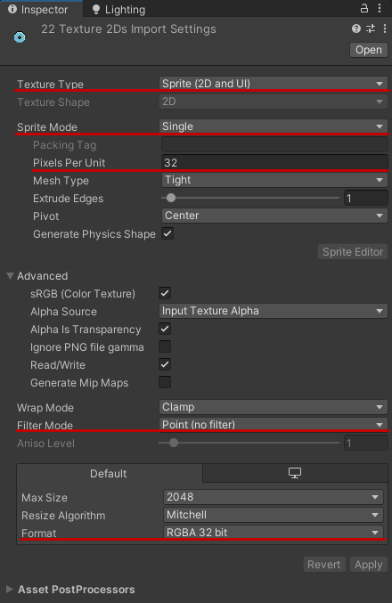

# New Skills
This part of the tutorial covers implementing custom skills into the game, with examples of three different skill mechanics.

## Preparations
Skills require a skill ID, an unlock ID, and a sprite. Just like with tiles, look at this spreadsheet: https://docs.google.com/spreadsheets/d/1tdUzB7I_MYt-21PAUd7llhtjSbyPcuJnGNYMEfMQeVg/edit?usp=sharing
1. Go into the "Skills" worksheet, and select an ID value that's not used by any tile listed there. An important thing to note for these IDs, is that the thousands and hundreds spaces determine the skill's type. The vanilla ones are:
	- 10XX - Warring Shop skills
	- 20XX - Combo Shop skills
	- 30XX - Guarding Shop skills
	- 40XX - Dancer Shop skills
	- 50XX - Artifact skills (appear only in the Moonlit Port)
	- 90XX - Merchant skills (appear in every shop)
	Note this down for future reference as your Skill ID.
2. Go into the "Quests/Unlocks" worksheet, select a **NEGATIVE** ID value that's not used by any unlock listed there. Positive values sometimes just don't work, and I haven't investigated why, since negative ones are perfectly fine. I decided to start tile unlocks from -1000, but that's not a requirement. Note it down for future reference as your Unlock ID

For the skill icon sprite, the guidelines are:
1. Make a sprite which fits within 16x16 pixels. For visual clarity you want to use the color palette of the associated skill type (except for Artifact skills, since they are all unique).
2. Save the image as a 16x16 pixels .png file, with a name of "SkillsIcons_\<TechnicalName>" (where technical name is typically the tile's name in PascalCase).
3. Configure the sprites (the same way as with tiles, though without changing the pivot). Select them all in the Unity project and set the following in the inspector:
	1. Texture Type: Sprite (2D and UI)
	2. Sprite Mode: Single
	3. Pixels per Unit: 32
	4. Filter: Point (no filter)
	5. Format: RGBA 32 bit  


Keep all the sprites selected and add them to the asset bundle: at the bottom of the inspector, you should see the AssetBundle dropdown (if you don't, click the double line to expand the collapsible section there). Open the dropdown, and select your asset bundle name, or add it if you're setting up assets for the first time. Use the asset bundle name you wrote at the beginning of the Load function in the Initial Setup tutorial.  
  


Once that is all set up, click Assets -> Build Asset Bundles. When that process finishes, copy your asset bundle and its .manifest file from AssetBundles to your mod's folder.  


## General Setup
1. Using DnSpy or a similar tool, access Shogun Showdown's scripts and find a script for the tile that's most similar to one you want to create (you want to look for scripts named "\*\*\*\*\*Skill" in Assembly-CSharp). This will be your template.
2. In your code library project, create a new script, named after the skill you want to add (the vanilla skills use the naming convention of skill's technical name + "Skill" - e.g. "ComboCurseSkill").
3. At the top of the script replace the "using" section with one copied from the template.
4. Change "internal" to "public" and add `: Skill` at the end of that line.
5. Copy the code from the inside of the class in your template into the new class. You can remove the comments.
	- SkillEnum - replace `SkillEnum.****;` with `(SkillEnum)ID`, where "ID" is the Skill ID you selected in preparations.
	- MaxLevel - replace the number with the maximum level allowed for the skill. Unique effects, like Reactive Shield or Two Faced Dancer typically have it set to 1. For other skills it varies. Here are the vanilla skills that have their Max Level set to more than 1:
	  level 2: Chikara Crush, Combo Recharge
	  level 3: Big Pockets, Central Dominion, Quick Recovery
	  level 5: Damaging Move, Dynamic Boost, Unfriendly Fire
	  level 10: Back Stabber, Healthy, Sniper
	- LocalizationTableKey - replace the text in quotation marks with a key you'll later use to assign skill's name and description. Tile's name in PascalCase is the standard.
6. We'll leave the rest of the skill script setup for more specific examples. For now move to your core script (Main, Master or whatever you named it) and in there:
7. If you don't yet have a
   ```csharp
	private static List<SkillData> skillsToLoad = new List<SkillData>
	{
	}
   ```
   then add it. Inside, for every skill you're adding, insert `new SkillData("TechnicalName", SkillID, UnlockID, typeof(SkillClassName), SOHandlingEnum.Generate, SOHandlingEnum.Generate, PurchaseCost),`, replacing TechnicalName, SkillID, UnlockID and SkillClassName with previously prepared values, and PurchaseCost with how many coins the skill should cost in the shops.
8. If you don't yet have a
   ```csharp
    private static Dictionary<(string table, string key), string> stringsToLoad = new Dictionary<(string, string), string>()
	 {
	 };
   ```
	then add it. Inside, for every tile you're adding, insert 2 lines: `{ ("Skills", "LocalizationKey_Description"), "Your skill's description as seen in game" },` and `{ ("Skills", "LocalizationKey_Name"), "Your skill's name as seen in game" },`, replacing LocalizationKey with the one you set in the skill script for both of them, and putting in the name and description you want to see in game. If you want the description to change with the skill's level (for example correctly displaying how much bonus damage it grants), put in `{0}` in place of the damage number.
9. If you want to add the text in other languages too, create a copy of the above dictionary, appending the name with underscore + the code of the language. For example: `stringsToLoad_pl` (codes of languages implemented in Shogun Showdown: English (en), French (fr), German (de), Spanish (es), Japanese (ja), Korean (ko), Polish (pl), Portuguese (pt), Russian (ru), Simplified Chinese (zh-hans), Traditional Chinese (zh-hant)). Then replace the values in that dictionary (the text that's meant to be visible in-game) with your translations.
10. Inside the load function, immediately after `Dictionary<string, object> contentData = new Dictionary<string, object>();`, add the lines you don't have out of
    ```csharp
    contentData["stringsToLoad"] = stringsToLoad;            contentData["skillsToLoad"] = skillsToLoad;
    ```
11. If you implemented any additional language tables, add them to content data in the same way - e.g.:
    ```csharp
    contentData["stringsToLoad_pl"] = stringsToLoad_pl;
    ```
12. If you've done everything right, you should be able to build the mod, then open the game and see a new skill unlockable in camp, with the stats you gave it, though without any special behaviour yet.

## Passive Skill
Passive skills are the most common in the vanilla game, covering such things as damage increasing skills, effects triggered on combo, or on damage taken. For this tutorial I'll be making a skill that's a combination of the first two: a skill that, when you get a combo kill, increases the damage of your next attack. Let's call it Combo Might.

Any of the "Combo X" skills can be used as a suitable template, I went with Combo Curse. Because it's a damage increasing skill that can be levelled up, I also added ExtraDamage property and ProcessDescription function copied from Unfriendly Fire (though again, these could be copied from almost every skill which increases damage and can be levelled up):
```csharp
 private int ExtraDamage => base.Level;

 protected override string ProcessDescription(string description)
 {
     return string.Format(description, ExtraDamage);
 }
```
And I set up the description string to work with this ProcessDescription function:
```csharp
{ ("Skills", "ComboMight_Name"), "Combo Might" },
{ ("Skills", "ComboMight_Description"), "Increase the damage of all attacks in your next queue by {0} when executing a combo kill." },
```
Finally, I replaced the contents of the ComboKill function - it's one that already gets called at the right time - PickUp() setting it up to trigger on a combo kill. All that it needed is to change the behaviour when that combo kill does happen to increasing the damage of the next attack queue.

But let's pause for a moment and examine what exactly is needed to achieve this:
As a baseline, we need to store a damage bonus number. Each time we get a combo kill, we increase that bonus by the ExtraDamage value. And each time we deal damage with a tile, we increase that damage by the bonus number. Finally, we reset the bonus damage to 0 at the end of executing an attack queue.

A thing to note is that we also need to have a buffer which holds the damage bonus gained so far, and only applies it starting next turn - otherwise it would be immediately reset to 0 at the end of the same attack queue that scored the combo kill. And we should be resetting the damage at the end of combat too, so it doesn't persist into the next one.

Finally, the extra damage value needs to be saved somewhere, so it doesn't get reset when you exit the game in the middle of combat.

To put this all into place we need to first define the additional variables:
```csharp
private int currentBonusDamage = 0;
private int bonusDamageBuffer = 0;
private bool bonusDamageUsed = false;
```

Then define the behaviour when we get a combo kill:
```csharp
private void ComboKill(Enemy enemy)
{
    // Add the extra damage to the buffer
    bonusDamageBuffer += ExtraDamage;
    InvokeSkillTriggeredEvent();
}
```
InvokeSkillTriggeredEvent() is a function built into the Skill class, which causes the skill icon to flash - all the vanilla skills use it to indicate when their effects trigger.

For dealing damage, we can take the code from any damage boosting skill as a template, and modify it slightly:
```csharp
private void ProcessAttack(Agent attacker, Agent defender, Hit hit)
{
    // Standard conditions for applying the bonus damage: the attacker must be the hero and the hit must synergize with skills
    if (!(attacker != Globals.Hero) && hit.SynergizeWithSkills)
    {
        hit.Damage += currentBonusDamage;
        SoundEffectsManager.Instance.Play("SpecialHit");
        InvokeSkillTriggeredEvent();
        // Set a flag to reset the bonus damage after this turn
        bonusDamageUsed = true;
    }
}
```

Then for resetting damage, I wrote the code from scratch, since it doesn't interact with any of the existing game's mechanics:
```csharp
 private void EndOfCombatTurn()
 {
     // Reset the bonus damage if it was used
     if(bonusDamageUsed) currentBonusDamage = 0;
     // Add any buffered bonus damage from combo kills that occurred during this turn
     currentBonusDamage += bonusDamageBuffer;
     // Save the current bonus damage in case the player closes the game before the next turn
     ModSaveManager.Set("ComboMight_currentBonusDamage", currentBonusDamage, ModSaveManager.StorageScope.Run);
     // Reset the flag and buffer for the next turn
     bonusDamageUsed = false;
     bonusDamageBuffer = 0;
 }

 private void EndOfCombat()
 {
     // Reset everything at the end of combat
     currentBonusDamage = 0;
     ModSaveManager.Set("ComboMight_currentBonusDamage", 0, ModSaveManager.StorageScope.Run);
     bonusDamageBuffer = 0;
     bonusDamageUsed = false;
 }
```
The one thing to explain here is ModSaveManager. This is a custom system I built into content loader for exactly this purpose: to have a convenient way of storing data that persists even when the game is closed, and can be permanent, or only for the duration of the run. To use it, you must add:
```csharp
using ContentLoader.HelperFunctions;
```
at the top of the script. Then you interact with it through two commands:
```csharp
Set(key, value);
Get(key, defaultValue);
```
Where key is the unique identifier for that value in the form of a string of text, value is what you want to store - typically some format of a number or a text string. Finally, defaultValue is what the Get function will give you if it doesn't find any value saved. If you want the data to be reset when you end a run, you need to add "ModSaveManager.StorageScope.Run" as a third argument to both Set and Get functions.

Finally, to make it all work, we need to subscribe each function to its respective event when we obtain the skill, and unsubscribe from them if we lose it:
```csharp
public override void PickUp()
{
    base.PickUp();
    // Subscribe to events
    EventsManager.Instance.ComboKill.AddListener(ComboKill);
    EventsManager.Instance.Attack.AddListener(ProcessAttack);
    EventsManager.Instance.EndOfCombatTurn.AddListener(EndOfCombatTurn);
    EventsManager.Instance.EndOfCombat.AddListener(EndOfCombat);

    // Load saved bonus damage if it exists
    currentBonusDamage = ModSaveManager.Get("ComboMight_currentBonusDamage", 0, ModSaveManager.StorageScope.Run);
}

public override void Remove()
{
    base.Remove();
    EventsManager.Instance.ComboKill.RemoveListener(ComboKill);
    EventsManager.Instance.Attack.RemoveListener(ProcessAttack);
    EventsManager.Instance.EndOfCombatTurn.RemoveListener(EndOfCombatTurn);
    EventsManager.Instance.EndOfCombat.RemoveListener(EndOfCombat);
}
```
Additionally, this is a good place to load the bonus damage if we're loading into the middle of combat - the game calls PickUp on all of player's skills when continuing a run.

EventsManager allows the skills to react to a wide variety of in-game events through this system of adding your functions as listeners. It's worth noting that every event requires a function to have specific arguments: in this case ComboKill expects an Enemy, Attack - two Agents and a Hit, and EndOfCombatTurn and EndOfCombat require functions with no arguments.
It's worth opening EventsManager using DnSpy or another such tool to see what can be tracked through it. Adding your own events is possible, but beyond the scope of this basics tutorial, as it requires delving into the code.

Some passive skills (Rogue Retail, Two Way Move, Cursing Move) apply a flag instead of, or in addition to events, because their desired behaviour is programmed in somewhere else in the game. This isn't something you need to concern yourself with, with perhaps one exception: if your skill adds a special effect applied to the target of the special move, you need to include in the PickUp():
```csharp
Globals.Hero.SpecialMove.HasEffectOnTarget = true;
```

## Single Trigger Skill
Some skills, rather than triggering on a specific event, activate once, when they're picked up. In the base game this applies to skills that modify the max health, special move cooldown, or the number of consumable slots. But there's nothing stopping you from having a different lasting effect. For this example, let's make it a Whetstone, which adds a +1 damage upgrade to two of your tiles.

One thing to think about, is whether or not the thing you're changing gets saved when you quit partway through the run, or not. Aforementioned potion slots, special move cooldown and max health do not, so implementing skills that modify them is simple - they give the benefit on PickUp and take it away on Remove. But something like this Whetstone idea modifies tile statistics, which are saved. So it needs special handling, otherwise it would give you 2 more damage upgrades each time you save and reload.

I'll take the Big Pockets skill as a template for this one. For how to apply the upgrade itself, I'll look at the StatsTileUpgrade class, specifically its Upgrade and CanUpgradeTile functions:
```csharp
public override void Upgrade(Tile tile)
{
	if (attackDelta != 0)
	{
		tile.Attack.Value += attackDelta;
		tile.Attack.BaseValue += attackDelta;
	}
	if (cooldownDelta != 0)
	{
		tile.Attack.Cooldown += cooldownDelta;
		tile.CooldownCharge = tile.Attack.Cooldown;
	}
	if (maxLevelDelta != 0)
	{
		tile.Attack.MaxLevel += maxLevelDelta;
	}
	if (levelDelta != 0)
	{
		tile.Attack.Level += levelDelta;
	}
	tile.Graphics.UpdateGraphics();
}

public override bool CanUpgradeTile(Tile tile)
{
	return _CanUpgradeTileAndWhy(tile).value;
}

private (bool value, string whyLocKey) _CanUpgradeTileAndWhy(Tile tile)
{
	if (tile.Attack.Level + levelDelta > tile.Attack.MaxLevel + maxLevelDelta)
	{
		return (value: false, whyLocKey: "CannotUpgrade_NoEmptyLevel");
	}
	if (maxLevelDelta > 0 && tile.Attack.MaxLevel + maxLevelDelta > Attack.maxMaxLevel)
	{
		return (value: false, whyLocKey: "CannotUpgrade_MaxLevel");
	}
	if (IsCooldownOnly && tile.Attack.Cooldown <= 0)
	{
		return (value: false, whyLocKey: "CannotUpgrade_MinCooldown");
	}
	if (attackDelta != 0 && !tile.Attack.HasValue)
	{
		return (value: false, whyLocKey: "CannotUpgrade_NoAttack");
	}
	if (tile.Attack.HasValue && tile.Attack.Value + attackDelta < 0)
	{
		return (value: false, whyLocKey: "CannotUpgrade_MinAttack");
	}
	if (attackDelta > 0 && tile.Attack.Value + attackDelta > Attack.maxValue)
	{
		return (value: false, whyLocKey: "CannotUpgrade_MaxDamage");
	}
	if (cooldownDelta > 0 && tile.Attack.Cooldown + cooldownDelta > Attack.maxCooldown)
	{
		return (value: false, whyLocKey: "CannotUpgrade_MaxCooldown");
	}
	return (value: true, whyLocKey: "Can upgrade. This variable should not be used.");
}
```
Discarding everything regarding changing max level or cooldown, we can see that the things of note are: the tiles we upgrade must have an empty upgrade slot, they must have an attack value, and cannot already be at max damage. And to apply the upgrade itself, we need to increase the tile's attack's Value and BaseValue, and also increment the tile's Level before calling UpdateGraphics().

Because I'll be doing more than just changing a single value, I'll create a separate ApplyUpgrade function, and call it from both PickUp and LevelUp:
```csharp
// Added at the top of the script
using System.Collections.Generic;
using System.Linq;
using UnityEngine;
using ContentLoader.HelperFunctions;
```
```csharp
 public override void LevelUp()
 {
     base.LevelUp();
     // if the level we're reaching is greater than the number of times we've used the skill this run, apply the upgrade.
     if (base.CurrentlyHeld && ModSaveManager.Get("Whetstone_uses", 0, ModSaveManager.StorageScope.Run) < Level)
     {
         ApplyUpgrade();
     }
 }

 public override void PickUp()
 {
     base.PickUp();
     // If we're actually picking up the skill for the first time (as opposed to loading it from a save), apply the upgrade
     if (ModSaveManager.Get("Whetstone_uses", 0, ModSaveManager.StorageScope.Run) == 0)
     {
         ApplyUpgrade();
     }
 }

 private void ApplyUpgrade()
 {
     // Get a list of hero's tiles
     List<Tile> heroTiles = TilesManager.Instance.hand.TCC.Tiles.ToList();
     // Filter out: tiles without an attack value, tiles without an upgrade slot, and tiles that already have maximum damage
     // We iterate backwards through the list to be able to safely remove tiles from it
     for (int i = heroTiles.Count-1; i > -1; i--)
     {
         bool hasAttackValue = heroTiles[i].Attack.HasValue;
         bool hasUpgradeSlot = heroTiles[i].Attack.Level < heroTiles[i].Attack.MaxLevel;
         bool notMaxDamage = heroTiles[i].Attack.Value < Attack.maxValue;
         if (!hasAttackValue || !hasUpgradeSlot || !notMaxDamage)
         {
             heroTiles.RemoveAt(i);
         }
     }

     // If there are no viable tiles, do nothing
     if (heroTiles.Count == 0)
     {
         return;
     }

     // Give 2 randomly selected viable tiles a +1 damage upgrade
     for (int i = 0; i < 2; i++)
     {
         int randomIndex = Random.Range(0, heroTiles.Count);
         Tile tile = heroTiles[randomIndex];
         tile.Attack.Value++;
         tile.Attack.BaseValue++;
         tile.Attack.Level++;
         tile.Graphics.UpdateGraphics();
         if(tile.Attack.Level == tile.Attack.MaxLevel)
         {
             heroTiles.RemoveAt(randomIndex);
             // If there was only one viable tile, don't try to upgrade a second one
             if (heroTiles.Count == 0)
             {
                 break;
             }
         }
     }

     // Count the uses of the skill this run and save it
     ModSaveManager.Set("Whetstone_uses", ModSaveManager.Get("Whetstone_uses", 0, ModSaveManager.StorageScope.Run) + 1, ModSaveManager.StorageScope.Run);
 }
```
ModSaveManager is once again used, in this case allowing us to keep track of how many times the skill's effect was applied this run - which in turns lets us distinguish actually obtaining the skill versus reloading it from save.
It's also worth noting that ApplyUpgrade includes fallback behaviours for when the player doesn't have enough viable tiles to upgrade. Is anyone going to buy this skill in that situation? Probably not. But "probably" means you still need to account for it, as an alternative is an error at best, or the run breaking at worst.

Finally, we need to reset this ModSaveManager value if we lose the skill - otherwise, if we re-obtained it, it wouldn't trigger properly:
```csharp
public override void Remove()
{
    base.Remove();
    // In case player re-obtained the skill after losing it, we need to reset the number of uses this run
    ModSaveManager.Set("Whetstone_uses", 0, ModSaveManager.StorageScope.Run);
}
```

## Hybrid Skill
The distinction between passive and single trigger skills is ultimately arbitrary. You can have skills that do both, and examples of such already exist in the base game - in the form of Fortress, Iron Skin and Mamushi Move. So let's add one of those as well.

Looking at the existing skills, one aspect that isn't explored, is taking away consumable slots - you can lose and gain special move cooldown, lose and gain max health, but only gain consumable slots.

What I came up to fit this idea, is a Dancer skill Unburdened: You lose one consumable slot, and in exchange, each time you use a consumable, your next action is free.

The first part of it is easy enough to achieve. Just take BigPockets as template, and swap around the slot gain and loss effects (and delete level up, since this will be a single-level skill):
```csharp
 public override void PickUp()
 {
     base.PickUp();
     PotionsManager.Instance.NPotionsSlots--;
 }

 public override void Remove()
 {
     base.Remove();
     PotionsManager.Instance.NPotionsSlots++;
 }
```

Detecting a consumable use is also easy enough - ComboDealSkill reveals that it can be done via a PotionUsed event:
```csharp
public override void PickUp()
{
    base.PickUp();
    PotionsManager.Instance.NPotionsSlots--;
    EventsManager.Instance.PotionUsed.AddListener(OnConsumableUsed);
}

public override void Remove()
{
    base.Remove();
    PotionsManager.Instance.NPotionsSlots++;
    EventsManager.Instance.PotionUsed.RemoveListener(OnConsumableUsed);
}

private void OnConsumableUsed(Potion consumable)
{

}
```

The one question to figure out, is how to make an action free? We know it's possible, because Two-Faced Dancer makes turning around a free action. So let's investigate there. Unfortunately we don't get an easy answer, as it seems that mechanic is coded in as a flag: Hero.TurnAroundIsFree. We could follow that lead deeper into the code, and figure out how exactly that flag affects the turn tracking systems. It would be quite a headache. I know, because I've done so already when creating the Swift Move skill for Shogun Showdown Extras. This is what it looks like:
```csharp
private bool TestForSpecialMovePerformed(ActionEnum action)
{
    Globals.Hero.Action = action;
    if (!Globals.Hero.ActionIsMove) return true;
    Dir dir = action == ActionEnum.MoveLeft ? Dir.Left : Dir.Right;
    if (HeroRegularMoveAllowed(dir)) return true;
    if (!Globals.Hero.SpecialMove.Allowed(Globals.Hero, dir)) return true;

    if (!blockExecution)
    {        Globals.Hero.StartCoroutine(Globals.Hero.PerformMoveAction(Globals.Hero.MoveDir));
    }
    blockExecution = false;

    Follow_UpSkill.skipNormalChecks = true;

    InvokeSkillTriggeredEvent();

    return false;
}
```
We can ignore references to blockExecution and Follow_UpSkill, as they relate to elements of the Extras mod. What we're left with is a function that intercepts the player's input. If the input is to move, and attempting to move in that direction would trigger a special move, the function triggers the special move manually, and returns false, so the execution of the normal turn is prevented. Otherwise it returns true and the function plays out as normal.

What we would want is: if the action **isn't** performed immediately after using a consumable, return true, and let things play out normally. Otherwise manually trigger the effect the action passed as an argument should cause, and return false. The code for that we can base on CombatManager.ProcessTurn:
```csharp
// Added at the top of the script
using CombatEnums;
using ContentLoader.HelperFunctions;
using System.Collections;
using UnityEngine;
```
```csharp
private bool justUsedPotion = false;

public override void PickUp()
{
    base.PickUp();
    PotionsManager.Instance.NPotionsSlots--;
    EventsManager.Instance.PotionUsed.AddListener(OnConsumableUsed);
    EventHelper.OnBeforePlayerAction += TestForFreeAction;
}

public override void Remove()
{
    base.Remove();
    PotionsManager.Instance.NPotionsSlots++;
    EventsManager.Instance.PotionUsed.RemoveListener(OnConsumableUsed);
    EventHelper.OnBeforePlayerAction -= TestForFreeAction;
}

private void OnConsumableUsed(Potion consumable)
{
    justUsedPotion = true;

    InvokeSkillTriggeredEvent();
}

private bool TestForFreeAction(ActionEnum action)
{
    if (!justUsedPotion) return true;
    justUsedPotion = false;
    Globals.Hero.Action = action;

    // Hero action handling copied from CombatManager.
    if (Globals.Hero.Action == ActionEnum.Wait)
    {
        Globals.Hero.Wait();
    }
    if (Globals.Hero.Action == ActionEnum.Attack)
    {
        Globals.Hero.ExecuteAttacksInQueue();
    }
    if (Globals.Hero.ActionIsMove)
    {
        Globals.Hero.StartCoroutine(Globals.Hero.PerformMoveAction(Globals.Hero.MoveDir));
    }
    if (Globals.Hero.Action == ActionEnum.FlipLeft)
    {
        Globals.Hero.FlipLeft();
    }
    if (Globals.Hero.Action == ActionEnum.FlipRight)
    {
        Globals.Hero.FlipRight();
    }

    return false;
}
```
The inclusion of EventHelper here is probably something to explain: that class is a part of content loader, which I made for situations where I needed an event that the EventsManager did not provide. It uses regular Action and Func events instead of the UnityEvent class, which is why you subscribe to them through "+=" instead of AddListener. These events can be used by any mod connected to the Content Loader. The most notable events it adds are the OnBeforePlayerAction used above, which allows you to intercept the input and potentially prevent it from going through to the CombatManager; OnShieldBroken, which provides as an argument the Agent who just lost their shield; OnSpecialMovePerformed, which is rather self-explanatory; and OnTileCreated, which as an argument provides that new tile.

## Bet Skill
Bets are a type of skill not present in the main game, instead being ones I created for the Gambler Package. But the format of having to fulfill a requirement before obtaining a reward can be useful outside of that context. Plus, we're missing one skill in order to have one of each of the base game's types.

So let's add an idea suggested by Apokalypse6: "Boosted Vigor - All Enemies in the next region have one more Max HP."

The base idea of bets was that they would give you money for completing challenges, but since it's meant to be a guarding skill, I'll do it a little differently here: Ecliptic Vigor - Increase the Max Health of all enemies in the next region by 1. Double all healing after clearing a region.

For template, I took code from my Frugal Bet skill from the Gambler Package, though the actual initial implementation turned out so different that I might as well have wrote it from scratch:
```csharp
public class EclipticVigorSkill : Skill
{
    public override SkillEnum SkillEnum { get; } = (SkillEnum)3006;

    public override int MaxLevel { get; protected set; } = 1;

    public override string LocalizationTableKey { get; } = "EclipticVigor";

    public override void PickUp()
    {
        base.PickUp();
        // The challenge is complete upon the end of a boss fight
        EventsManager.Instance.EndBossFight.AddListener(CompleteBet);
    }

    public override void Remove()
    {
        EventsManager.Instance.EndBossFight.RemoveListener(CompleteBet);
        base.Remove();
    }

    private void CompleteBet()
    {
	    // Make sure this is the first time the completion is being triggered
        int pastTriggers = ModSaveManager.Get<int>("EclipticVigorTriggers", 0, ModSaveManager.StorageScope.Run);

        if(pastTriggers == 0)
        {
            InvokeSkillTriggeredEvent();
	        ModSaveManager.Set<int>("EclipticVigorTriggers", 1, ModSaveManager.StorageScope.Run);
        }           
    }
}
```

For increasing the enemy health, it would be a good idea to look at the day effect which does the same thing. And while that turns out to be a dead end, because the enemies have their higher HP values hardcoded, looking around the Enemy and Agent classes reveals AddToMaxHealth and SetMaxHealth functions, which are used almost exclusively to manipulate the hero's max health, but should work perfectly fine for enemies - if we have an event which triggers when they're spawned. And unfortunately we don't. So this will serve as an introduction to patching, because adding a custom event is one of the simplest things you can do with it, as it's a matter of setting up a single, small script:
```csharp
using HarmonyLib;
using System;

namespace TemplateMod
{
    [HarmonyPatch(typeof(Enemy), "Awake")]
    static class Enemy_Awake_Patch
    {
        public static Action<Enemy> OnEnemyAwake;
        static void Postfix(Enemy __instance)
        {
            OnEnemyAwake?.Invoke(__instance);
        }
    }
}
```
The core things to pay attention to here are:
- "\[HarmonyPatch(typeof(Enemy), "Awake")\]" tells the mod loader that we want to attach code to the Awake() function of the Enemy class.
- "static void Postfix" is a function that is called immediately after the function we attach it to.
- "(Enemy \_\_instance)" will give us the reference to the specific enemy whose Awake function just played.

Then we use the event implemented here to give every enemy +1 Max Health when they spawn, until the player receives the reward:
```csharp
 public override void PickUp()
 {
     base.PickUp();
     // The challenge is complete upon the end of a boss fight
     EventsManager.Instance.EndBossFight.AddListener(CompleteBet);
     int pastTriggers = ModSaveManager.Get<int>("EclipticVigorTriggers", 0, ModSaveManager.StorageScope.Run);
     if (pastTriggers == 0)
     {
     Enemy_Awake_Patch.OnEnemyAwake += BoostEnemyHealth;
     }
 }

 public override void Remove()
 {
     EventsManager.Instance.EndBossFight.RemoveListener(CompleteBet);
     int pastTriggers = ModSaveManager.Get<int>("EclipticVigorTriggers", 0, ModSaveManager.StorageScope.Run);
     if (pastTriggers == 0)
     {
         Enemy_Awake_Patch.OnEnemyAwake -= BoostEnemyHealth;
     }
     base.Remove();
 }

 private void BoostEnemyHealth(Enemy enemy)
 {
     if(enemy is Boss) return;
     enemy.AddToMaxHealth(1);
 }

 private void CompleteBet()
 {
     // Make sure this is the first time the completion is being triggered
     int pastTriggers = ModSaveManager.Get<int>("EclipticVigorTriggers", 0, ModSaveManager.StorageScope.Run);

     if (pastTriggers == 0)
     {
         InvokeSkillTriggeredEvent();
         ModSaveManager.Set<int>("EclipticVigorTriggers", 1, ModSaveManager.StorageScope.Run);
         Enemy_Awake_Patch.OnEnemyAwake -= BoostEnemyHealth;
     }
 }
```
We skip boosting the health of bosses, because that can break things in their initialization logic.

And to apply the actual doubled healing, we need to once again investigate the code, because there's no obvious "HeroHealed" event. But tracking the functionality of the healing potion we can discover that healing causes the HeroHPUpdateDetailed event to be called used for both damage and healing. So we can use that, just filtering out the health decreases:
```csharp
public override void PickUp()
{
    base.PickUp();
    // The challenge is complete upon the end of a boss fight
    EventsManager.Instance.EndBossFight.AddListener(CompleteBet);
    int pastTriggers = ModSaveManager.Get<int>("EclipticVigorTriggers", 0, ModSaveManager.StorageScope.Run);
    if (pastTriggers == 0)
    {
        Enemy_Awake_Patch.OnEnemyAwake += BoostEnemyHealth;
    }
    else
    {
        EventsManager.Instance.HeroHPUpdateDetailed.AddListener(DoubleHealing);
    }
}

public override void Remove()
{
    EventsManager.Instance.EndBossFight.RemoveListener(CompleteBet);
    int pastTriggers = ModSaveManager.Get<int>("EclipticVigorTriggers", 0, ModSaveManager.StorageScope.Run);
    if (pastTriggers == 0)
    {
        Enemy_Awake_Patch.OnEnemyAwake -= BoostEnemyHealth;
    }
    else
    {
        EventsManager.Instance.HeroHPUpdateDetailed.RemoveListener(DoubleHealing);
    }
        base.Remove();
}
 
private void DoubleHealing((int requestedDeltaHP, int actualDeltaHP, int heroHP) hpDetails)
{
    if (hpDetails.requestedDeltaHP <= 0) return;
    if(skipNextDoubling)
    {
        skipNextDoubling = false;
        return;
    }
    skipNextDoubling = true;
    Globals.Hero.AddToHealth(hpDetails.requestedDeltaHP);
}

private void CompleteBet()
{
    // Make sure this is the first time the completion is being triggered
    int pastTriggers = ModSaveManager.Get<int>("EclipticVigorTriggers", 0, ModSaveManager.StorageScope.Run);

    if (pastTriggers == 0)
    {
        InvokeSkillTriggeredEvent();
        ModSaveManager.Set<int>("EclipticVigorTriggers", 1, ModSaveManager.StorageScope.Run);
        Enemy_Awake_Patch.OnEnemyAwake -= BoostEnemyHealth;
        EventsManager.Instance.HeroHPUpdateDetailed.AddListener(DoubleHealing);
    }
}
```
I'm using pastTriggers in PickUp and Remove so that if you load from a saved game *after* completing a bet, you immediately get the doubled healing and enemies aren't buffed. "skipNextDoubling" in DoubleHealing is also an important element - without it the skill would try to double its own healing, at best making any healing fully restore the hero's health, at worst creating an infinite loop.
