# New Tiles Part 1
This part of the tutorial covers implementing custom tiles into the game, with examples of a few simple tile types.

You can see all the scripts made for the template mod, and the tile pivot reference image used in this tutorial here: https://github.com/Erukolindo/ShogunShowdownModdingResources/tree/master/NewTiles/Resources

## Preparations
There are two things to prepare before we get into coding: The IDs and Sprites. For IDs, you'll want to take a look at this spreadsheet: https://docs.google.com/spreadsheets/d/1tdUzB7I_MYt-21PAUd7llhtjSbyPcuJnGNYMEfMQeVg/edit?usp=sharing
There, I am compiling all IDs relevant to modding, both from the vanilla game, and ones already used by uploaded mods.
1. Go into the "Tiles" worksheet, and select an ID value that's not used by any tile listed there. Note it down for future reference as your Attack ID.
2. Go into the "Quests/Unlocks" worksheet, select a **NEGATIVE** ID value that's not used by any unlock listed there. Positive values sometimes just don't work, and I haven't investigated why, since negative ones are perfectly fine. I decided to start tile unlocks from -1000, but that's not a requirement. Note it down for future reference as your Unlock ID

For sprites, there are a few guidelines to follow:
1. If you haven't yet, make a folder for your mod in the Unity project's Assets folder. This is where you'll be saving the sprites.  
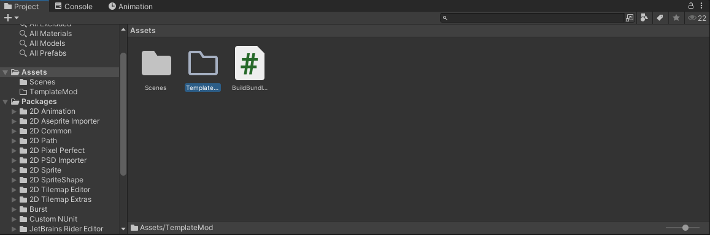
2. You want to make the icon that is displayed on the tile. This icon can be up to 19 pixels tall, and up to 14 pixels wide for tiles with damage numbers, or 22 pixels for tiles without them.  
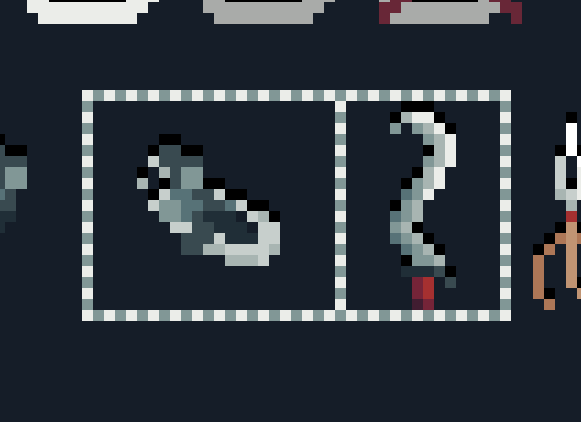
3. All vanilla tiles have black pixels at the top of every section of pixels. I'd recommend doing the same for visual consistency (the added pixels need to fit in the 19 pixels height limit)
4. Each sprite needs to be a separate image. It should be saved as a .png file, with a name of "Tiles\_\<TechnicalName>\_\<EnchantmentName>", where technical name is typically the tile's name in PascalCase, and the enchantment names are: "Curse", "DoubleStrike", "Ice", "None" (for the default version of the sprite), "PerfectStrike", "Poison", and "Shockwave".  
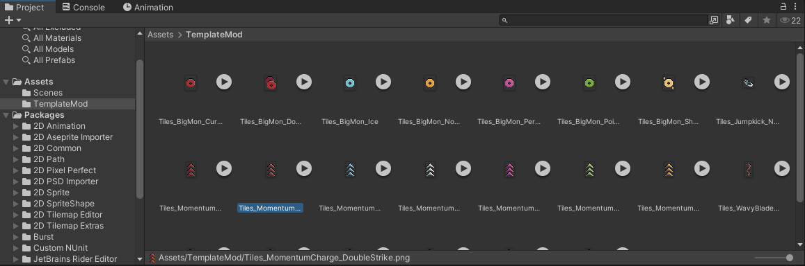
5. Create a sprite for each vanilla enchantment you want the tile to be compatible with.

Once all the sprites are ready, it's time to configure them. Select them all in the Unity project and set the following in the inspector:
1. Texture Type: Sprite (2D and UI)
2. Sprite Mode: Single
3. Pixels per Unit: 32
4. Read/Write: On
5. Filter: Point (no filter)
6. Format: RGBA 32 bit  
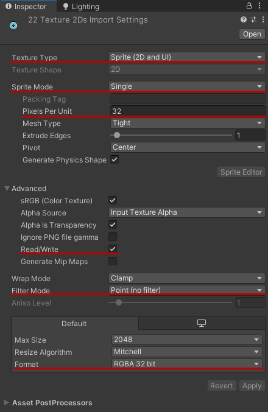
After you click Apply, there are two more things to set up: Pivot and AssetBundle.

To set up the Asset Bundle, keep all the sprites selected. At the bottom of the inspector, you should see the AssetBundle dropdown (if you don't, click the double line to expand the collapsible section there). Open the dropdown, and select your asset bundle name, or add it if you're setting up assets for the first time. Use the asset bundle name you wrote at the beginning of the Load function in the Initial Setup tutorial.  
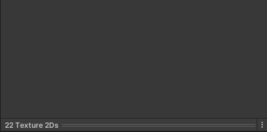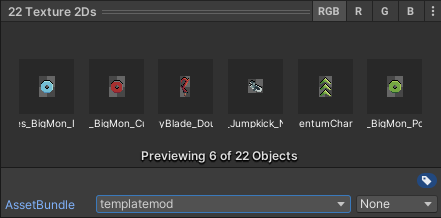

For the pivot:
1. Select a single image, and open the sprite editor.  
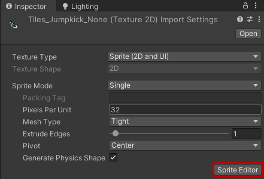
2. In the sprite editor, change pivot unit mode to pixels.  
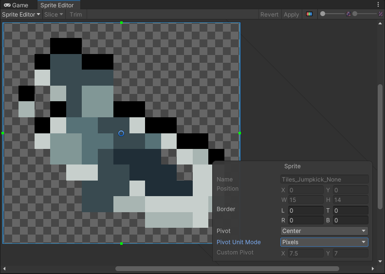
3. Move the blue ring to change the pivot's position. The part of the sprite where you place it will fall on the intersection of the four pixels marked in the image below - so for tiles without a damage number you typically want it to be slightly below center, while for the rest somewhere on the lower left. The best way to figure out the placement is to open the marked image and your sprite on a single canvas and align them the way you want to see in the game.  
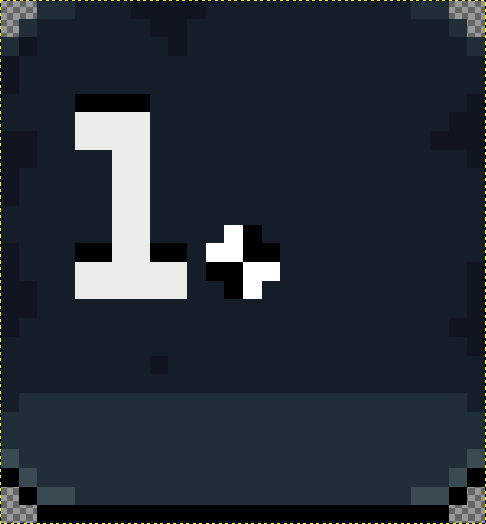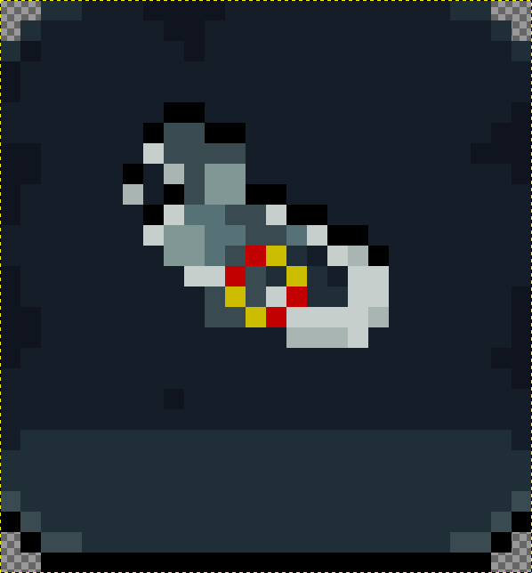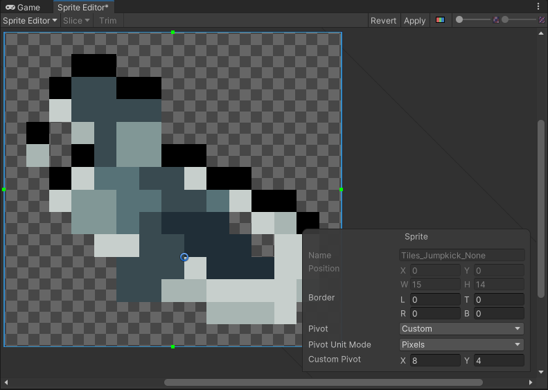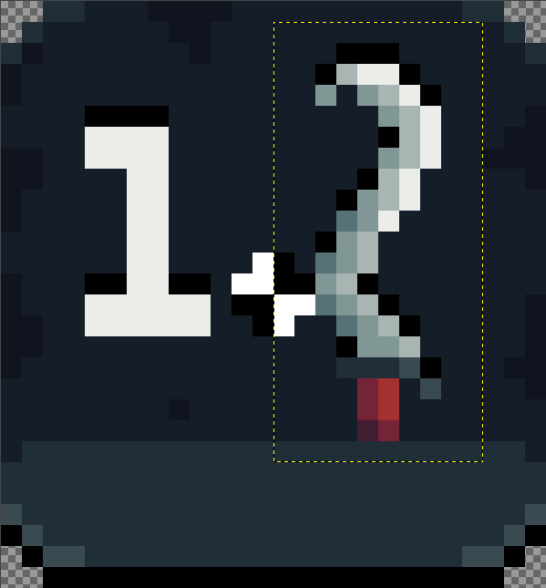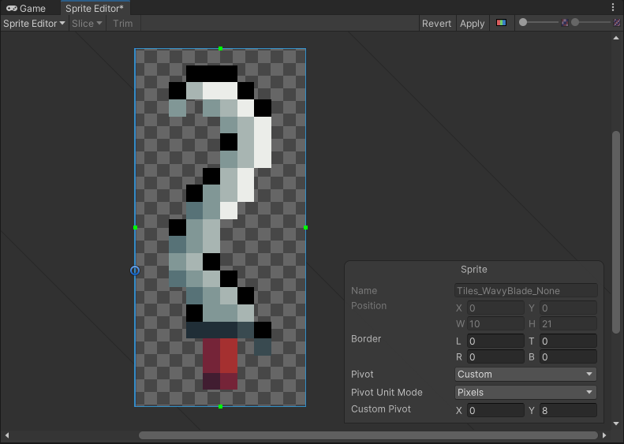
4. Remember to click apply once you're done.
5. Apply the same pivot to the rest of the sprites for that attack. You can do it all at once by copying the pivot vector from the **inspector** of the sprite you prepared (You need to right click the **empty space** underneath "Pivot" and to the left of the X and Y fields for both copying and pasting in order to copy both X and Y values at once), then selecting the rest of the sprites, and in the inspector changing their pivot to custom, and pasting in the vector.  
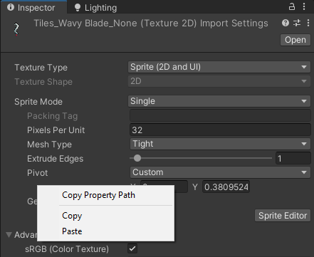
6. Again, remember to click Apply.

Once that is all set up, click Assets -> Build Asset Bundles. When that process finishes, copy your asset bundle and its .manifest file from AssetBundles to your mod's folder.  
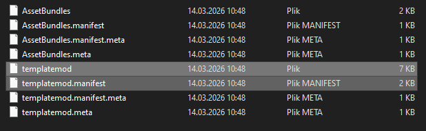

## General Setup
1. Using DnSpy or a similar tool, access Shogun Showdown's scripts and find a script for the tile that's most similar to one you want to create (you want to look for scripts named "\*\*\*\*\*Attack" in Assembly-CSharp). This will be your template.    
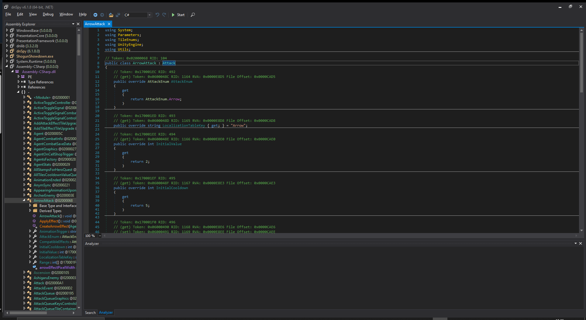
2. In your code library project, create a new script, named after the tile you want to add (the vanilla tiles use the naming convention of tile name in PascalCase + "Attack" - e.g. "WavyBladeAttack"). 
3. At the top of the script replace the "using" section with one copied from the template.
4. Change "internal" to "public" and add `: Attack` at the end of that line.  
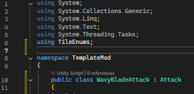
5. Copy the code from the inside of the class in your template into the new class. You can remove the comments.
6. Some vanilla attacks are derived from a different class than `Attack`, like ChargeAttack having `: BaseChargeAttack` - in that case, you will also have to open that base class too, and copy the code from it as well. If any of the variables end up being defined twice as a result, for example:
   ```csharp
   protected override RelativeDir RelativeChargeDirection => RelativeDir.Forward;
   (...)
   protected abstract RelativeDir RelativeChargeDirection { get; }
   ```
   merge them together - remove `abstract` from the second line, and add to it the value assigned in the `override` line, then remove the `override` line. In this case the result would be `protected RelativeDir RelativeChargeDirection { get; } = RelativeDir.Forward;`
7. Adjust the data as needed:
	- AttackEnum - replace `return AttackEnum.****;` with `return (AttackEnum)ID`, where "ID" is the Attack ID you selected in preparations.
	- LocalizationTableKey - replace the text in quotation marks with a key you'll later use to assign tile's name and description. Tile's name in PascalCase is the standard.
	- InitialValue - replace the number with the base damage of the tile. Set to -1 if the tile shouldn't have a damage number, otherwise it must be in a 0-9 range.
	- InitialCooldown - self explanatory. Must be in a 0-8 range.
	- Range - there are some special cases, but for most tiles just list the cells that the attack should affect, where "1" is a cell directly in front of the character, "-1" is directly behind and each following number is just one cell further away.
	- AnimationTrigger - custom animations are a complex topic that will get its own tutorial eventually, so for now just copy the trigger from a vanilla tile you think is close enough. `""` = no special animation.
	- CompatibleEffects - list which vanilla enchantments you want the tile to be compatible with. The full list is:
	```csharp
	{
		AttackEffectEnum.Ice,
		AttackEffectEnum.DoubleStrike,
		AttackEffectEnum.Shockwave,
		AttackEffectEnum.Poison,
		AttackEffectEnum.PerfectStrike,
		AttackEffectEnum.Curse
	};
	```
	- (Not Required) ClosestTargetOnly - if it's not in the script, or it has `= true;`, then the attack made using built in systems will only hit a single target in either direction, even if its range covers multiple cells. If it has `= false;` or nothing at the end, it will hit all cells in range.
	- (Not Required) IsDirectional - its value is determined the same way as for ClosestTargetOnly, and the only thing that uses it in the vanilla game is the BackStabber skill, which cannot trigger on tiles set up as non-directional (such as Lightning and Scar Strike).
	- (Not Required) IsNonLethal - is only active when set up as `protected override bool IsNonLethal { get; set; } = true;`. It should be obvious what this one does.
8. We'll leave the rest of the attack script setup for more specific examples. For now move to your core script (Main, Master or whatever you named it) and in there:
9. If you don't yet have a
   ```csharp
   private static List<TileData> attacksToLoad = new List<TileData>
   {
   };
   ```
	then add it. Inside, for every tile you're adding, insert `new TileData("TechnicalName", AttackID, UnlockID, typeof(AttackClassName), SOHandlingEnum.Generate),`, replacing TechnicalName, AttackID, UnlockID and AttackClassName with previously prepared values.
10. If you don't yet have a
   ```csharp
   private static Dictionary<(string table, string key), string> stringsToLoad = new Dictionary<(string, string), string>()
   {
   };
   ```
	then add it. Inside, for every tile you're adding, insert 2 lines: `{ ("TileAttacks", "LocalizationKey_Description"), "Your attack's description as seen in game" },` and `{ ("TileAttacks", "LocalizationKey_Name"), "Your attack's name as seen in game" },`, replacing LocalizationKey with the one you set in the attack script for both of them, and putting in the name and description you want to see in game.
11. If you want to add the text in other languages too, create a copy of the above dictionary, appending the name with underscore + the code of the language. For example: `stringsToLoad_pl` (codes of languages implemented in Shogun Showdown: English (en), French (fr), German (de), Spanish (es), Japanese (ja), Korean (ko), Polish (pl), Portuguese (pt), Russian (ru), Simplified Chinese (zh-hans), Traditional Chinese (zh-hant)). Then replace the values in that dictionary (the text that's meant to be visible in-game) with your translations.
12. If you don't yet have a
    ```csharp
    private static Dictionary<AttackEnum, List<TagEnum>> defaultTileTags = new Dictionary<AttackEnum, List<TagEnum>>()
    {
    };
    ``` 
    then add it. Inside, for every tile you're adding, insert `{ (AttackEnum)AttackID, new List<TagEnum> { TagEnum.XXX, TagEnum.XXX, TagEnum.XXX, TagEnum.XXX } },`, replacing AttackID with an actual value, and setting all tags that make sense for the attack. You can find a list of all tile tags and what tags are assigned to various vanilla and modded tiles in the data spreadsheet.
13. Inside the load function, immediately after `Dictionary<string, object> contentData = new Dictionary<string, object>();`, add the lines you don't have out of
    ```csharp
    contentData["stringsToLoad"] = stringsToLoad;            contentData["attacksToLoad"] = attacksToLoad;
    contentData["tileTags"] = defaultTileTags;
    ```
14. If you implemented any additional language tables, add them to content data in the same way - e.g.:
    ```csharp
    contentData["stringsToLoad_pl"] = stringsToLoad_pl;
    ```
15. If you've done everything right, you should be able to build the mod, then open the game and see a new tile unlockable in camp, with the stats you gave it, though without any special behaviour yet.
This is how I set up the Main class for the tiles I'll show in this tutorial:  
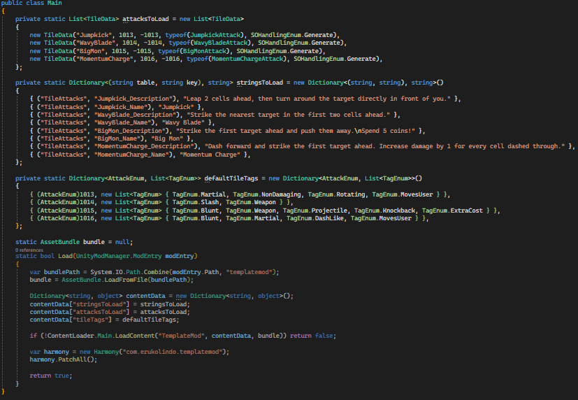

## Non-Damaging Tile
The first tile I'll be showing the exact implementation of will be Jumpkick, suggested by Apokalypse6 as "1. Jumpkick: jump over the first cell in front of you, land and turn the enemy in front of you around.".

As a template, I used BoAttack, as it is the only tile in the base game that flips a target at a specific relative position. If you jump over one tile to land in the next one, then hit the target in front, that means its range is 3 and that's what I set it to. For animation trigger I chose "DashForward" - used by the ChargeAttack. I also gave it a short cooldown of 3 turns, due to how situational I'm expecting this tile to be.

I also decided to give it Free Play for the same reason. You can look at something like MirrorAttack in the base game to see how that's done:
```csharp
public override void Initialize(int maxLevel)
{
	base.Initialize(maxLevel);
	base.TileEffect = TileEffectEnum.FreePlay;
}
```
And that is the pattern you'll want to follow when it comes to implementing things: most of the time you can figure out how to implement a specific element by checking how something is done somewhere in the main game.

Another function I needed to add was Begin - it is the function overridden by an attack script for attacks that can fail completely - which is where the tile flashes red instead of executing. And once again, I'm going to copy it from the MirrorAttack, though this time I'll also have to make modifications. The Mirror tile fails if there is an immovable agent on the other side of the battlefield. Meanwhile this should fail if there is any agent in the tile we want the user to land on. Which will look something like this:
```csharp
private Cell landingCell; // Keep the reference to the landing cell so movement doesn't need to look for it again
public override bool Begin(Agent attacker)
{
    base.Begin(attacker); // Run the default Begin function
    landingCell = Attacker.Cell.Neighbour(Attacker.FacingDir, 2); // Get the cell 2 ahead of where we're standing
    if(landingCell == null || landingCell.Agent != null) // If this goes beyond the battlefield, or the cell is occupied
    {
        return false; // Tile will fail.
    }
    StartCoroutine(PerformAttack()); // Run the tile's effects manually - necessary for non-damaging tiles
    return true;
}
```

And as I pointed out in the code's comments, a "PerformAttack" coroutine is necessary for tiles which don't deal damage, so that's what I'll be adding next. This part I'll base on Charge attack, as it is similar to what I'm looking for - moving the character forward, then doing something else once the movement is finished - for Charge it's dealing damage, for this tile it will be rotating the target.
```csharp
private IEnumerator PerformAttack()
{
    Cell hitCell = landingCell.Neighbour(Attacker.FacingDir, 1); // Get the tile to potentially hit with rotation

    Vector3 hitPoint = hitCell ? (landingCell.transform.position + hitCell.transform.position) / 2f : landingCell.transform.position;
    yield return StartCoroutine(Dash(base.Attacker.transform.position, hitPoint, 15)); // Visually move the attacker a little ahead of the landing tile
    Attacker.Cell = landingCell; // Actually move the attacker to the landing tile
    if(hitCell && hitCell.Agent && hitCell.Agent.Movable) // If there's a movable agent in the cell in front of us...
    {
        FlipTarget(hitCell.Agent); // ...turn them around. FlipTarget taken unchanged from BoAttack
        yield return new WaitForSeconds(Agent.turnAroundTime);
    }

    Attacker.SetIdleAnimation(value: true);
    yield return StartCoroutine(base.Attacker.MoveToCoroutine(hitPoint, landingCell.transform.position, .2f)); // Reset the attacker's visuals to be centered on the cell
    if (base.Attacker == Globals.Hero)
    {
        EventsManager.Instance.HeroPerformedMoveAttack.Invoke(); // Notify the game we moved with a tile - used by skills
    }
    base.Attacker.AttackInProgress = false;
}

private IEnumerator Dash(Vector3 from, Vector3 to, float speed) //copied unchanged from ChargeAttack
{
    SoundEffectsManager.Instance.Play("Dash");
    float time = Vector3.Distance(from, to) / speed;
    yield return StartCoroutine(base.Attacker.MoveToCoroutine(from, to, time, 0f, createDustEffect: true, createDashEffect: true));
}
```
I had to add `using UnityEngine;` at the top of the script, due to this part utilizing the Vector3 variable type, and `using System.Collections;` for the IEnumerator type to work properly.

And that's all. After building the mod I was able to go into the game, unlock Jumpkick in the Camp, find it during gameplay, and use it without errors.

## Melee Tile
Compared to non-damaging tiles, attacks can (but don't have to be) quite simple in comparison. A good example of that is a melee attack suggested by nichen2348: "Wavy blade: stab 2 tiles in front but cannot hit both enemies, big dmg".

From this description, the closest vanilla tile is the Spear, so I copied SpearAttack's code to use as a template. This tile is something between Spear and Tetsubo, having the range of the latter but still being meant as a single-target attack. To that end I decided to give it 3 damage and 4 cooldown. For animation, Hookblade would be the closest match, but because of that tile's special behaviour it's animation doesn't work on basic attacks. So I went with the simple KatanaAttack animation.

To expand a little on the animation viability: if the tile implements a ` public override bool Begin(Agent attacker)` and has something along the lines of `StartCoroutine(PerformAttack());`, then animations don't matter for it. But if it instead implements `public override void ApplyEffect()` then its effects will only trigger once the animation calls for them to be executed, limiting which animation triggers can be used for these tiles to the following:
- ArrowAttack
- BackStrike
- BladeOfPatienceAttack
- BoAttack
- CrossbowAttack
- CrossbowReload
- DragonPunch
- KatanaAttack
- LightningAttack
- NagibokuAttack
- SaiAttack
- ShadowKama
- ShieldAttack
- SpearAttack
- Summon
- SwirlAttack
- TanegashimaAttack
- TetsuboAttack
- TwinTessenAttack

Statistics and animation aside, this tile is meant to work almost exactly like spear, just without piecing damage. Piercing damage can be removed from a tile that has it by setting:
```csharp
protected override bool ClosestTargetOnly { get; set; } = true;
```

And that's all that's needed to finish it.

## Projectile Tile
Projectiles have to be handled a little differently due to their delayed damage, triggered by the projectile reaching the target. It is worth noting that Arrow and Crossbow are actually closer to melee attacks than projectiles, because they do hit instantly, and use visual effects to represent the attack. Actual projectiles are things like Shuriken, Mon or Curse.

And as an example I will implement one suggested by Eiki:
"Big Mon Damage: 6-7 Cooldown 6 - Throw big mon first target ahead and push them as far back. Spend 5-10 mon"

Obviously, the best script to use as the template is Mon. I adjusted its damage to 7, cooldown to 6, keeping the rest the same.

I decided to make it use up 5 coins on use, which required two adjustments:
In Begin() I changed the failure condition from `Globals.Coins <= 0` to `Globals.Coins <= 4` - making it fail if the player has 4 or less coins.
And in perform attack I changed `Globals.Coins--;` to `Globals.Coins-=5;`.

Then to add knockback to the projectile, we can take a loot at the KiPushAttack and take from it
```csharp
if (target.Movable)
{
	pushInProgress = true;
	yield return StartCoroutine(target.Pushed(base.Attacker.FacingDir));
	pushInProgress = false;
}
```
Putting it in the same place in the BigMon script: that is inside PerformAttack, immediately after `HitTarget(target);`

And you can see that this code block uses "pushInProgress". Adding it is simple - just adding `private bool pushInProgress;` to the class. But how that variable is used is more important. KiPushAttack also implements:
```csharp
public override bool WaitingForSomethingToFinish()
{
	return pushInProgress;
}
```
This is something that needs to be copied to the BigMonAttack as well, so that the turn doesn't end while the enemy is still moving due to knockback, as that could cause a bunch of different issues. With that simple addition, this tile is complete.

## Dash-Like Tile
The final tile example I'll show in this part of the tutorial will be Momentum Charge, suggested by Apokalypse6: "Momentum Charge: Dash and damage the first enemy ahead. This tile does 1 less damage than it's base damage. Increase by 1 for every cell you run across."

The obvious choice for a template is Charge - meaning I had to copy the code from both ChargeAttack and BaseChargeAttack, then resolve the errors caused by `RelativeChargeDirection` being defined twice.

The one change in mechanics needed here, is bonus damage based on the distance moved. And it will come in 2 parts - calculating the damage and applying it to the hit.

To do so, we just have to calculate the distance as the difference between indexes of the starting and ending cell of the charge at the beginning of DashAndHit, add it to the tile's damage:
```csharp
int distanceMoved = Mathf.Abs(Attacker.Cell.IndexInGrid - targetMoveCell.IndexInGrid);
Value += distanceMoved;
```
And remember to reset the damage value back to what it should be at the end of that function:
```csharp
Value -= distanceMoved;
```

And that's it.

## Testing Tools
Content Loader implements some tools to help you test the things you add, all accessed using the numpad. Specifically:
- Set your skull count to 999 by pressing numpadDivide `/`.
- Reroll the current reward, shop or random deck by pressing numpadMultiply `*`.
- Remove an unlock from your save file by holding down Ctrl and inputting the Unlock's ID while in the main menu.